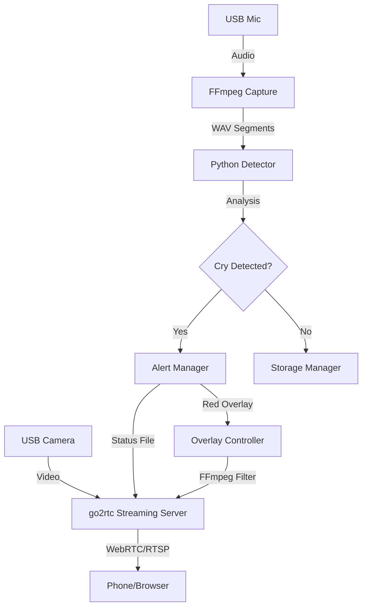

# bbwatch 🍼

**FOSS Baby Monitor with cry detection and visual alerts**

A fully open-source baby monitor built for Raspberry Pi with USB webcam. Features real-time cry detection using DSP (no cloud, no ML required), visual overlay alerts, and automatic disk management.

## Features

- 🎥 **Live video streaming** via WebRTC/RTSP (go2rtc)
- 🔊 **Cry detection** using bandpass filter (250-800 Hz) + energy analysis
- 🔴 **Visual alerts** - red overlay for cry, blue for system errors
- 💾 **Automatic disk management** - 1GB limit with oldest-first cleanup
- 🔒 **Fully local** - no cloud, no accounts, no data leaves your network
- 🐳 **Docker support** - develop anywhere, deploy to RPi

## Quick Start

### Development (Docker)

The easiest way to get started is using Docker.

```bash
# Clone and enter directory
git clone https://github.com/ArthurVil/bbwatch.git
cd bbwatch

# Run tests
make docker-test
```

### Full Stack Demo (Local)

Run the complete system (Audio + Video + Overlays) on your PC using Docker Compose (requires webcam):

```bash
cd docker
docker-compose up
```

- **Video Stream**: Open http://localhost:1984
- **Logs**: Watch terminal for "Cry detected" alerts

### Component Demos (Docker)

Isolate specific components for testing:

```bash
# Run audio demo only (records from mic)
make docker-demo

# Run video demo (requires webcam + X11 forwarding)
make docker-demo-video
```
```

### Development (Local)

```bash
# Create virtual environment
python3 -m venv .venv
source .venv/bin/activate

# Install dependencies (including dev tools)
make install-dev

# List available hardware devices
make devices

# Run tests
make test
```

### Raspberry Pi Deployment

1. **Prerequisites**:
   - Raspberry Pi 4 (2GB+ recommended)
   - Docker & Docker Compose installed
   - USB Webcam with microphone connected

2. **Deploy**:
   ```bash
   # Set your Pi's hostname or IP
   export RPI_HOST=babypi.local

   # Copy files and start services
   ./scripts/deploy.sh
   ```

## Configuration

Copy `config.yaml` to customize settings:

```yaml
audio:
  segment_duration_s: 3.0    # Duration of analysis window
  overlap_s: 1.0             # Sliding window overlap
  sample_rate: 16000         # 16kHz is sufficient for cry detection

detection:
  bandpass_low_hz: 250.0     # Typical baby cry fundamental freq start
  bandpass_high_hz: 800.0    # Typical baby cry fundamental freq end
  rms_threshold: 0.02        # Sensitivity (lower = more sensitive)
  min_active_ratio: 0.3      # % of segment that must be loud to trigger

alerts:
  trigger_high: 0.03         # Hysteresis: start alert above this
  trigger_low: 0.015         # Hysteresis: stop alert below this
  cooldown_s: 5.0            # Minimum time between alerts

storage:
  max_size_mb: 1024.0        # Max disk usage for recordings
```

## Architecture



## Project Structure

```
bbwatch/
├── bbwatch/              # Python package source
│   ├── config.py         # Configuration management
│   ├── detector.py       # DSP-based cry detection
│   ├── hardware.py       # Hardware discovery
│   └── main.py           # Application entry point
├── docker/               # Docker environments
│   ├── Dockerfile.dev    # x86_64 dev image
│   └── Dockerfile.rpi    # ARM64 production image
├── scripts/              # Helper scripts
│   ├── demo.py           # Audio detection demo
│   ├── demo_video.py     # Video overlay demo
│   └── list_devices.py   # Hardware discovery tool
└── tests/                # Pytest suite
```

## Development Commands

We provide a `Makefile` for common tasks:

| Command | Description |
|---------|-------------|
| `make install-dev` | Install all dependencies |
| `make test` | Run unit and integration tests |
| `make lint` | Run ruff (linting) and mypy (types) |
| `make docker-build` | Build local dev image |
| `make docker-demo` | Run audio demo in Docker |
| `make docker-build-rpi` | Cross-compile ARM64 image |

## License

MIT License - see [LICENSE](LICENSE)
