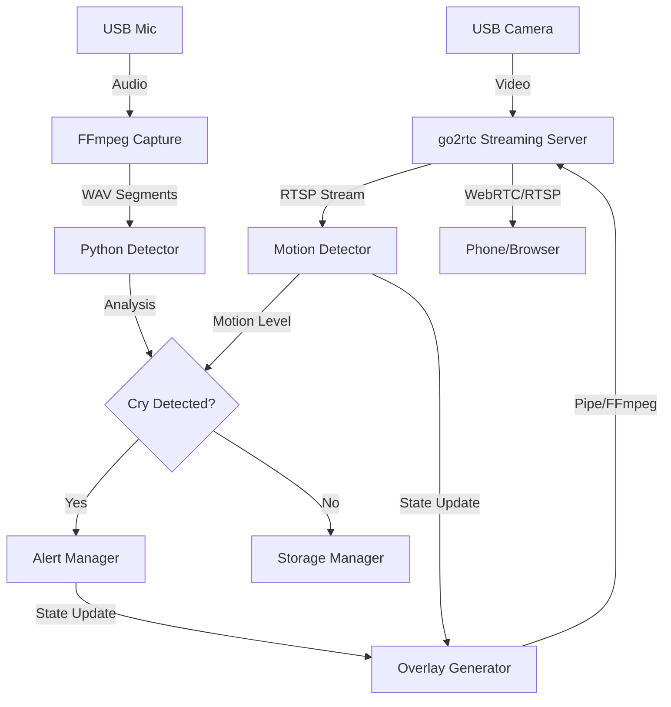

# bbwatch 🍼

**FOSS Baby Monitor with cry detection and visual alerts**

A fully open-source baby monitor built for Raspberry Pi with USB webcam. Features real-time cry detection using DSP (no cloud, no ML required), visual overlay alerts, and automatic disk management.

> [!CAUTION]
> **SAFETY DISCLAIMER**: BBWatch is a hobby project software and is **NOT** a certified medical device or a reliable safety device. It relies on complex software, network conditions, and consumer hardware which can fail at any time. **NEVER** rely solely on this software for the safety of your child. Always maintain direct supervision or use certified baby monitoring appliances as your primary safety tool.

## Features

- 🎥 **Live video streaming** via WebRTC/RTSP (go2rtc)
- 🔊 **Cry detection** using bandpass filter (250-800 Hz) + energy analysis
- 🔴 **Visual alerts** - red overlay for cry, blue for system errors
- 💾 **Automatic disk management** - 1GB limit with oldest-first cleanup
- 🔒 **Fully local** - no cloud, no accounts, no data leaves your network
- 🐳 **Docker support** - develop anywhere, deploy to RPi

## Quick Start

### Development (Docker)

The easiest way to get started is using Docker.

```bash
# Clone and enter directory
git clone https://github.com/ArthurVil/bbwatch.git
cd bbwatch

# Run tests
make docker-test
```

### Full Stack Demo (Local)

Run the complete system (Audio + Video + Overlays) on your PC using Docker Compose (requires webcam):

```bash
cd docker
docker-compose up
```

- **Web Interface**: Open http://localhost:1984
- **VLC / Media Player**: Open network stream `rtsp://localhost:8554/babycam`
- **Logs**: Watch terminal for "Cry detected" and "Motion detected" alerts
- **Overlay Guide**: 
  - 🟨 **Yellow**: Motion detected
  - 🟪 **Purple**: Cry detected (Alert active)
  - 🟥 **Red**: Both motion and cry detected
  - 🟦 **Blue**: System error (Overlay data stale)

### Component Demos (Docker)

Isolate specific components for testing:

```bash
# Run audio demo only (records from mic)
make docker-demo

# Run video demo (requires webcam + X11 forwarding)
make docker-demo-video
```
```

### Development (Local)

```bash
# Create virtual environment
python3 -m venv .venv
source .venv/bin/activate

# Install poetry
pip install poetry

# Install dependencies (including dev tools)
make install-dev

# List available hardware devices
make devices

# Run tests
make test
```

### Raspberry Pi Deployment

1. **Prerequisites**:
   - Raspberry Pi 4 (2GB+ recommended)
   - Docker & Docker Compose installed
   - USB Webcam with microphone connected

2. **Deploy**:
   ```bash
   # Set your Pi's hostname or IP
   export RPI_HOST=babypi.local

   # Copy files and start services
   ./scripts/deploy.sh
   ```

3. **Alternative: Run from GHCR (Docker)**:
   If you don't want to build from source, you can pull the pre-built ARM64 image:
   ```bash
   docker pull ghcr.io/arthurvil/bbwatch:rpi-latest
   ```
   Then run it using the provided `docker/docker-compose.yml` (after adjusting it for your local needs).

## Configuration

Copy `config.yaml` to customize settings:

```yaml
audio:
  segment_duration_s: 3.0    # Duration of analysis window
  overlap_s: 1.0             # Sliding window overlap
  sample_rate: 16000         # 16kHz is sufficient for cry detection

detection:
  bandpass_low_hz: 250.0     # Typical baby cry fundamental freq start
  bandpass_high_hz: 800.0    # Typical baby cry fundamental freq end
  rms_threshold: 0.02        # Sensitivity (lower = more sensitive)
  min_active_ratio: 0.3      # % of segment that must be loud to trigger

alerts:
  trigger_high: 0.03         # Hysteresis: start alert above this
  trigger_low: 0.015         # Hysteresis: stop alert below this
  cooldown_s: 5.0            # Minimum time between alerts

storage:
  max_size_mb: 1024.0        # Max disk usage for recordings
```

## Hardware Discovery & Configuration

Before running the full system, you need to identify the correct audio and video devices.

1. **List Devices**:
   Run the following command to see all detected hardware and the recommended configuration snippet:
   ```bash
   make devices
   ```
   Example output:
   ```
   AUDIO DEVICES (ALSA)
   card 1: Device [USB Audio], device 0: USB Audio [USB Audio]
     👉 Suggested config.yaml for 'USB Audio':
        audio:
          device_index: "hw:1,0"

   ...
   VIDEO DEVICE FILES
     /dev/video0
     👉 Suggested config.yaml for 'Webcam':
        motion:
          device_index: "/dev/video0"
   ```

   > [!NOTE]
   > If you see an error like `pactl not found`, it usually means PulseAudio/PipeWire utilities are not installed. You can safely ignore this if you are using ALSA hardware directly (e.g., `hw:1,0`).

2. **Configure `config.yaml`**:
   Copy the suggested snippet from `make devices` into your `config.yaml`:

   ```yaml
   audio:
     device_index: "hw:1,0"   # ALSA ID from 'make devices'
     channels: 1              # Most webcam mics are mono
     sample_rate: 16000

   motion:
     threshold: 25            # Sensitivity (lower = more sensitive)
     fps: 10                  # Processing rate (balance CPU/responsiveness)

   log_level: "INFO"
   ```

   > [!TIP]
   > For Raspberry Pi deployment with `go2rtc`, the `device_index` is automatically set to the RTSP stream in `docker-compose.yml`. You only need to touch this if running locally or debugging.

3. **Disk Management**:
   The `storage.max_size_mb` setting ensures the monitor doesn't fill your card. It will automatically delete the oldest WAV segments when the limit is reached.

### Latency Tuning & Performance

To achieve low-latency streaming (<1s delay):

1. **Overlay FPS**: In `config.yaml`, set `alerts.overlay_fps` to a value that matches your `docker/go2rtc.yaml` configuration.
   > [!IMPORTANT]
   > `go2rtc.yaml` has a hardcoded `-framerate 5` for the overlay pipe input. If you change `overlay_fps` in `config.yaml`, you MUST manually update `docker/go2rtc.yaml` to match, or the stream may drift/lag.

2. **Buffer Sizes**:
   - `motion.history_len`: Lower values (e.g., 5-20) reduce plotting history but improve perceived responsiveness of the graph.
   - `motion.fps`: Higher values (e.g., 10-30) give smoother data but consume more CPU.

3. **Motion Thresholds**:
   - `motion.threshold`: 10-20 is good for sensitive detection.
   - `motion.blur_size`: 5-9 reduces noise.

## Architecture

For a deep dive into the system architecture, decision records (ADRs), and perception algorithms, see [docs/architecture.md](docs/architecture.md).

For other guides:
- [User Guide](docs/user_guide.md): Detailed configuration and usage instructions.
- [Development Guide](docs/development.md): Setup, testing, and contribution workflows.
- [Deployment Guide](docs/deployment.md): Step-by-step Raspberry Pi installation.




## Project Structure

```
bbwatch/
├── bbwatch/              # Python package source
│   ├── config.py         # Configuration management
│   ├── detector.py       # DSP-based cry detection
│   ├── hardware.py       # Hardware discovery
│   └── main.py           # Application entry point
├── docker/               # Docker environments
│   ├── Dockerfile.dev    # x86_64 dev image
│   └── Dockerfile.rpi    # ARM64 production image
├── scripts/              # Helper scripts
│   ├── demo.py           # Audio detection demo
│   ├── demo_video.py     # Video overlay demo
│   └── list_devices.py   # Hardware discovery tool
└── tests/                # Pytest suite
```

## Development Commands

We provide a `Makefile` for common tasks:

| Command | Description |
|---------|-------------|
| `make install-dev` | Install all dependencies |
| `make test` | Run unit and integration tests |
| `make lint` | Run ruff (linting) and mypy (types) |
| `make docker-build` | Build local dev image |
| `make docker-demo` | Run audio demo in Docker |
| `make docker-build-rpi` | Cross-compile ARM64 image |

## License

gnu gpl v3 - see [LICENSE](LICENSE)
