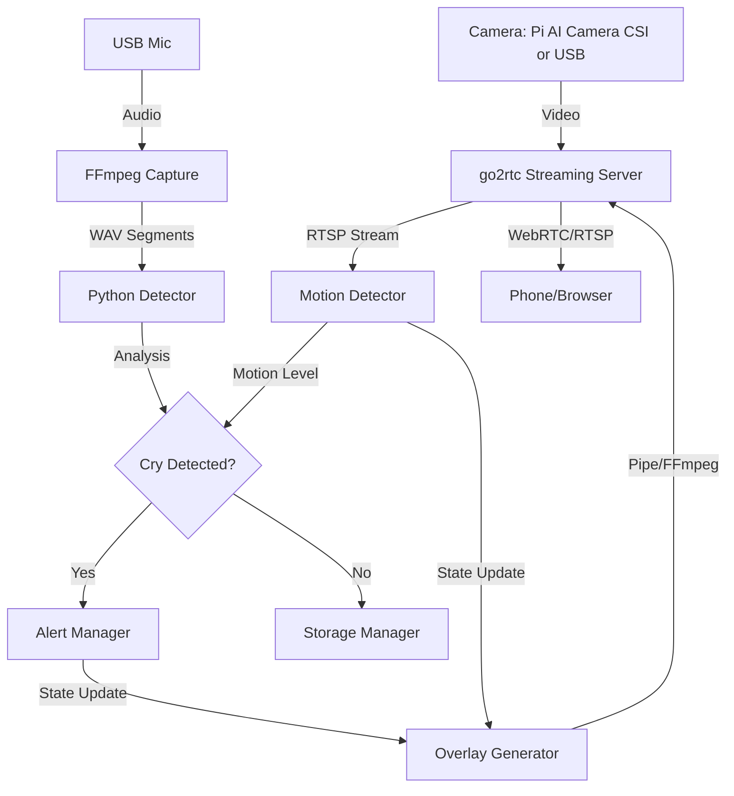

# bbwatch 🍼

**FOSS Baby Monitor with cry detection and visual alerts**

A fully open-source baby monitor built for Raspberry Pi. The production setup runs on a Raspberry Pi 5 with the Raspberry Pi AI Camera (Sony IMX500, CSI) at 1080p@10fps — see [docs/camera.md](docs/camera.md) — but plain USB webcams remain supported. Features real-time cry detection using DSP (no cloud, no ML required), visual overlay alerts, and automatic disk management.

> [!CAUTION]
> **SAFETY DISCLAIMER**: BBWatch is a hobby project software and is **NOT** a certified medical device or a reliable safety device. It relies on complex software, network conditions, and consumer hardware which can fail at any time. **NEVER** rely solely on this software for the safety of your child. Always maintain direct supervision or use certified baby monitoring appliances as your primary safety tool.

## Features

- 🎥 **Live video streaming** via WebRTC/RTSP (go2rtc)
- 🔊 **Cry detection** using bandpass filter + energy analysis (default band 250-800 Hz; the shipped `config.yaml` tunes it to 250-2000 Hz)
- 🔴 **Visual alerts** - red overlay for cry, blue for system errors
- 💾 **Automatic disk management** - 1GB limit with oldest-first cleanup
- 🔒 **Fully local** - no cloud, no accounts, no data leaves your network
- 🐳 **Docker support** - develop anywhere, deploy to RPi

## Quick Start

### Development (Docker)

The easiest way to get started is using Docker.

```bash
# Clone and enter directory
git clone https://github.com/ArthurVil/bbwatch.git
cd bbwatch

# Run tests
make docker-test
```

### Full Stack Demo (Local)

Run the complete system (Audio + Video + Overlays) on your PC (requires webcam). Note that Docker Compose runs only the `bbwatch` container — go2rtc runs separately on the host (`docker/go2rtc.yaml` is the config for USB-webcam setups):

```bash
# Start go2rtc on the host with docker/go2rtc.yaml, then:
make up        # docker compose -f docker/docker-compose.yml up -d
make logs
```

- **Web Interface**: Open http://localhost:1984
- **VLC / Media Player**: Open network stream `rtsp://localhost:8554/babycam`
- **Logs**: Watch terminal for "Cry detected" and "Motion detected" alerts
- **Overlay Guide**: 
  - 🟨 **Yellow**: Motion detected
  - 🟪 **Purple**: Cry detected (Alert active)
  - 🟥 **Red**: Both motion and cry detected
  - 🟦 **Blue**: System error (Overlay data stale)

### Component Demos (Docker)

Isolate specific components for testing:

```bash
# Run audio demo only (records from mic)
make docker-demo

# Run video demo (requires webcam + X11 forwarding)
make docker-demo-video
```

### Development (Local)

```bash
# Create virtual environment
python3 -m venv .venv
source .venv/bin/activate

# Install poetry
pip install poetry

# Install dependencies (including dev tools)
make install-dev

# List available hardware devices
make devices

# Run tests
make test
```

### Raspberry Pi Deployment

The deployment is split in two: **go2rtc runs natively on the Pi host** (systemd), while **bbwatch runs in Docker**. The stock go2rtc image has no rpicam/libcamera support, so the CSI camera must be driven by a host-native go2rtc using the Pi's libcamera stack (`deploy/go2rtc-host.yaml` + `deploy/go2rtc.service`). The compose stack therefore runs only the `bbwatch` container (with `network_mode: host`).

See [docs/SETUP_RPI5.md](docs/SETUP_RPI5.md) for the full walkthrough and [docs/camera.md](docs/camera.md) for the AI Camera (IMX500) characteristics.

1. **Prerequisites**:
   - Raspberry Pi 5 (2GB+ recommended)
   - Raspberry Pi AI Camera (CSI) — or a USB webcam
   - USB microphone (or webcam mic)
   - Docker & Docker Compose installed (rootless works)

2. **Install go2rtc on the host** (once):
   ```bash
   # Adjust mic device, FIFO path and User= in the files first
   sudo cp deploy/go2rtc-host.yaml /etc/go2rtc.yaml
   sudo cp deploy/go2rtc.service /etc/systemd/system/go2rtc.service
   sudo systemctl daemon-reload && sudo systemctl enable --now go2rtc
   ```

3. **Point bbwatch at the host go2rtc**:
   Set `RPI_HOST=<pi LAN IP>` in `docker/.env`. Docker on the Pi is rootless, so `localhost` inside the container does **not** reach the real host — only its LAN IP does.

#### Run the stack by hand

On the Pi, from the repo root:

```bash
# 1. Start go2rtc (host-native, config at /etc/go2rtc.yaml)
sudo systemctl start go2rtc

# 2. Start bbwatch (Docker)
docker compose -f docker/docker-compose.yml up -d bbwatch   # or: make up

# 3. View the stream from any device on your LAN
#    http://<pi-ip>:1984/stream.html?src=babycam

# Logs
docker logs -f docker-bbwatch-1
journalctl -u go2rtc -f
```

#### Alternative: Run from GHCR (Docker)

If you don't want to build from source, you can pull the pre-built ARM64 image:
```bash
docker pull ghcr.io/arthurvil/bbwatch:rpi-latest
```
Then run it using the provided `docker/docker-compose.yml` (after adjusting it for your local needs).

## Configuration

Copy `config.yaml` to customize settings. The shipped file carries a low-latency tuning; where it differs from the built-in defaults (`bbwatch/config.py`), the default is noted:

```yaml
audio:
  segment_duration_s: 0.33   # Analysis window (default: 3.0 — shipped tuning trades CPU for latency)
  overlap_s: 0.1             # Sliding window overlap (default: 1.0)
  sample_rate: 48000         # Default: 16000 (16kHz is sufficient for cry detection)

detection:
  bandpass_low_hz: 250.0     # Typical baby cry fundamental freq start
  bandpass_high_hz: 2000.0   # Default: 800.0 — shipped tuning widens the cry band
  rms_threshold: 0.02        # Sensitivity (lower = more sensitive)
  min_active_ratio: 0.03     # % of segment that must be loud to trigger (default: 0.3)

alerts:
  trigger_high: 0.03         # Hysteresis: start alert above this
  trigger_low: 0.015         # Hysteresis: stop alert below this
  cooldown_s: 1.0            # Minimum time between alerts (default: 5.0)
  overlay_fps: 15            # Must match -framerate in the go2rtc config (see Latency Tuning)

storage:
  max_size_mb: 1024.0        # Max disk usage for recordings
```

Any field can also be overridden at runtime via `BBWATCH_`-prefixed environment variables with `__` as nested delimiter (e.g. `BBWATCH_AUDIO__DEVICE_INDEX=rtsp://...`); environment variables take precedence over `config.yaml`.

## Hardware Discovery & Configuration

Before running the full system, you need to identify the correct audio and video devices.

1. **List Devices**:
   Run the following command to see all detected hardware and the recommended configuration snippet:
   ```bash
   make devices
   ```
   Example output:
   ```
   FOUND DEVICES:

     AUDIO (ALSA):
       [0] USB Audio (hw:1,0)

     VIDEO (V4L2):
       [V0] Webcam (/dev/video0)

   ============================================================
   SUGGESTED CONFIGURATION (Copy-paste this into config.yaml)
   ============================================================

   audio:
     device_index: "hw:1,0"

   host:
     video_device: "/dev/video0"
     pulse_source: ""
   ```

   > [!NOTE]
   > If you see an error like `pactl not found`, it usually means PulseAudio/PipeWire utilities are not installed. You can safely ignore this if you are using ALSA hardware directly (e.g., `hw:1,0`).

2. **Configure `config.yaml`**:
   Copy the suggested snippet from `make devices` into your `config.yaml`:

   ```yaml
   audio:
     device_index: "hw:1,0"   # ALSA ID from 'make devices'
     channels: 1              # Most webcam mics are mono
     sample_rate: 16000

   motion:
     threshold: 10            # Sensitivity (lower = more sensitive)
     fps: 15                  # Processing rate (balance CPU/responsiveness)

   log_level: "INFO"
   ```

   > [!TIP]
   > For Raspberry Pi deployment with `go2rtc`, the `device_index` is automatically set to the RTSP stream in `docker-compose.yml`. You only need to touch this if running locally or debugging.

3. **Disk Management**:
   The `storage.max_size_mb` setting ensures the monitor doesn't fill your card. It will automatically delete the oldest WAV segments when the limit is reached.

### Latency Tuning & Performance

To achieve low-latency streaming (<1s delay):

1. **Overlay FPS**: In `config.yaml`, set `alerts.overlay_fps` to a value that matches your go2rtc configuration.
   > [!IMPORTANT]
   > The go2rtc config has a hardcoded `-framerate 15` for the overlay pipe input (`docker/go2rtc.yaml` and `deploy/go2rtc-host.yaml`). If you change `overlay_fps` in `config.yaml`, you MUST manually update the go2rtc config to match, or the stream may drift/lag.

2. **Buffer Sizes**:
   - `motion.history_len`: Lower values (e.g., 5-20) reduce plotting history but improve perceived responsiveness of the graph.
   - `motion.fps`: Higher values (e.g., 10-30) give smoother data but consume more CPU.

3. **Motion Thresholds**:
   - `motion.threshold`: 10-20 is good for sensitive detection.
   - `motion.blur_size`: 5-9 reduces noise.

4. **Measure it**: every pipeline stage is instrumented (`bbwatch/latency.py`). Aggregated `LATENCY` summaries are logged at INFO every `latency_report_interval_s` (default 10 s); per-event `latency ...` lines appear at DEBUG. See [docs/latency.md](docs/latency.md) for how to read them and for measured RPi5 numbers.

## Architecture

For a deep dive into the system architecture, decision records (ADRs), and perception algorithms, see [docs/architecture.md](docs/architecture.md).

For other guides:
- [User Guide](docs/user_guide.md): Detailed configuration and usage instructions.
- [Development Guide](docs/development.md): Setup, testing, and contribution workflows.
- [Deployment Guide](docs/deployment.md): Step-by-step Raspberry Pi installation.
- [RPi5 Setup](docs/SETUP_RPI5.md): Host-native go2rtc + Docker bbwatch walkthrough.
- [Camera Report](docs/camera.md): Raspberry Pi AI Camera (Sony IMX500) characteristics and constraints.
- [Latency Report](docs/latency.md): Per-stage latency instrumentation and measured RPi5 numbers.



## Project Structure

```
bbwatch/
├── bbwatch/                  # Python package source
│   ├── main.py               # BabyMonitor orchestrator / entry point
│   ├── config.py             # Pydantic configuration management
│   ├── capture.py            # Sliding-window audio capture (FFmpeg)
│   ├── detector.py           # DSP-based cry detection
│   ├── alert.py              # Hysteresis alert state machine
│   ├── motion.py             # Frame-differencing motion detection
│   ├── overlay_generator.py  # Dynamic overlay rendered into a FIFO
│   ├── latency.py            # Per-stage pipeline latency instrumentation
│   ├── hardware.py           # Hardware discovery (ALSA/V4L2/libcamera)
│   └── ...                   # storage, watchdog, recording, notifier, ...
├── deploy/                   # Host-native go2rtc (RPi): config + systemd unit
├── docker/                   # Docker environments
│   ├── Dockerfile.dev        # x86_64 dev image
│   ├── Dockerfile.rpi        # ARM64 production image
│   ├── docker-compose.yml    # bbwatch container (go2rtc runs on the host)
│   └── go2rtc.yaml           # go2rtc config for non-RPi (USB webcam) setups
├── scripts/                  # Helper scripts (demos, list_devices, deploy)
├── docs/                     # Guides, reports, and ADRs (docs/decisions/)
└── tests/                    # Pytest suite (unit / integration / functional)
```

## Development Commands

We provide a `Makefile` for common tasks:

| Command | Description |
|---------|-------------|
| `make install-dev` | Install all dependencies |
| `make test` | Run unit and integration tests |
| `make lint` | Run ruff (linting) and mypy (types) |
| `make docker-build` | Build local dev image |
| `make docker-demo` | Run audio demo in Docker |
| `make docker-build-rpi` | Cross-compile ARM64 image |

## License

gnu gpl v3 - see [LICENSE](LICENSE)
